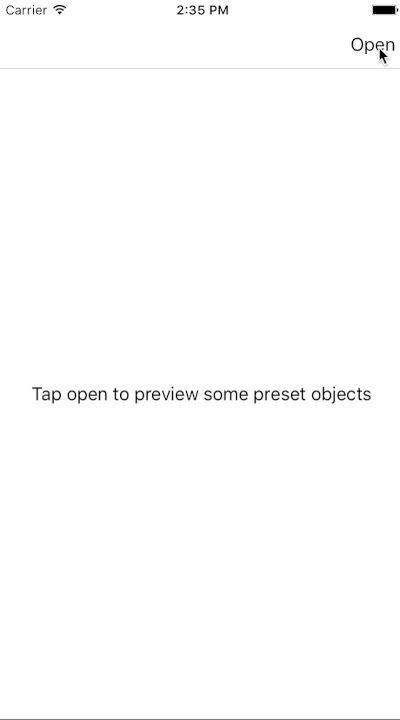

# RBSRealmBrowser

[](https://travis-ci.org/bearjaw/RBSRealmBrowser)
[](http://cocoapods.org/pods/RBSRealmBrowser)
[](http://cocoapods.org/pods/RBSRealmBrowser)
[](http://cocoapods.org/pods/RBSRealmBrowser)

RBSRealmBrowser is based on NBNRealmBrowser by  [Nerdish by Nature](https://github.com/nerdishbynature/NBNRealmBrowser). It's a simple lightweight browser that lets you inspect which objects are currently in your realm database on your iOS device or simulator.
Simply edit your existing object's property values by switching into edit mode.

## Features

- Quickly browse realm objects
- Edit Realm objects
- Delete Realm objects
- Search for specific values
- Quick actions (start the browser from the homescreen)
- Open RealmBrowser constrained to specific classes (i.e. you only want to inspect the Person classes) 

For editing objects these types are currently supported:

- Bool
- String
- Int
- Float
- Double



## Usage

To run the example project, clone the repo, and run `pod install` from the Example directory first.

This browser only works with RealmSwift because Realm (Objective-C) and RealmSwift 'are not interoperable and using them together is not supported.'

```swift
class ViewController: UIViewController {
    
    override func viewDidLoad() {
        super.viewDidLoad()
        // add a UIBarButtonItem 
        let bbi = UIBarButtonItem(title: "Open", style: UIBarButtonItemStyle.plain, target: self, action:   #selector(ViewController.openBrowser))
        navigationItem.rightBarButtonItem = bbi
    }

    @objc func openBrowser() {
        guard let realmBrowser = RBSRealmBrowser.realmBrowser(showing: ["Person"]) else { return }
        present(realmBrowser, animated: true, completion: nil)
    }
}
```

## Use one of the methods to browse your Realm database
### All these convenience methods come with a second method using a  `classes` option. Use these methods if you want to restrict the results to (a) specific class(es).
If you pass in `nil`, all objects will be displayed. The `[String]` must be composed
of classNames and they must match. 

If you quickly want to access all objects in  the default realm database use one these two methods:
```swift
// get the RealmBrowser for default Realm 
public static func realmBrowser() -> UINavigationController?
```
```swift
// get the RealmBrowser for default Realm, filtered by an optional class names array 
public static func realmBrowser(showing classes:[String]?) -> UINavigationController?
```

If you want to specifiy a realm use one of these two methods:
```swift
// get the RealmBrowser for Realm 
public static func realmBrowserForRealm(_ realm: Realm) -> UINavigationController?
```
```swift
// Pass an optional array of class names you want to display & your realm
public static func realmBrowserForRealm(_ realm: Realm, showing filteredClasses:[String]?) -> UINavigationController?
```
If you want to access your realm at a given URL use one of theses methods:
```swift
// get the RealmBrowser for Realm at a specific url
public static func realmBroswerForRealmURL(_ url: URL) -> UINavigationController?
```
```swift
// Same as the above but you can pass an optional [String] containing Class names
public static func realmBrowser(showing classes:[String]?,aURL URL:URL) -> UINavigationController?
```

## Quick actions

This latest version supports dynamic quick actions on iOS 9.0 and above.
To use the quick action add this code to your AppDelegate applicationDidFinishLaunching(:) method.

```swift
// add the realmbrowser quick action to your shortcut items array
   if #available(iOS 9.0, *) {
       application.shortcutItems = [RBSRealmBrowser.addBrowserQuickAction()]
   } else {
       // Fallback on earlier versions
   }
```

Now handle the action: 

```swift
    func application(_ application: UIApplication, performActionFor shortcutItem: UIApplicationShortcutItem, completionHandler: @escaping (Bool) -> Void) {
        
        // handle the quick action
        guard let rb = RBSRealmBrowser.realmBrowser() else {
            print("realm browser is nil!")
            return
        }
        let vc = (window?.rootViewController)! as UIViewController
        vc.present(rb, animated: true)
    }
```


## Try

To try the example project, clone the repo, and run `pod try` from the Example directory first.

## Requirements

- Xcode 8
- iOS 9.0+
- Swift 3.0 for any release after 0.1.4
- Swift 4.0 for any release after 0.1.9
- Swift 4.1 for any release after 0.2.2
- Swift 4.2 for any release after 0.2.4
- Swift 5.0 for any release after 0.2.9


## Installation

RBSRealmBrowser is available through [CocoaPods](http://cocoapods.org). To install
it, simply add the following line to your Podfile:

```ruby
pod 'RBSRealmBrowser', :configurations => ['Debug']

```
## Future features
What's on the roadmap... 🚀
- [ ] Tests
- [x] Be able to create objects
- [x] Clean up
- [x] Live reload the browser if updates happen in the background
- [x] Layout improvements
- [ ] Basic search 
- [ ] Better search

## Documentation
Available method documentation [here](http://cocoadocs.org/docsets/RBSRealmBrowser/0.1.7/)

## RealmBrowser for Android

Realm browser by Jonas Rottmann for your Android projects available [jonasrottmann/realm-browser](https://github.com/jonasrottmann/realm-browser)

## Author

Max Baumbach, bearjaw.dev@gmail.com

## License

RBSRealmBrowser is available under the MIT license. See the LICENSE file for more info.
